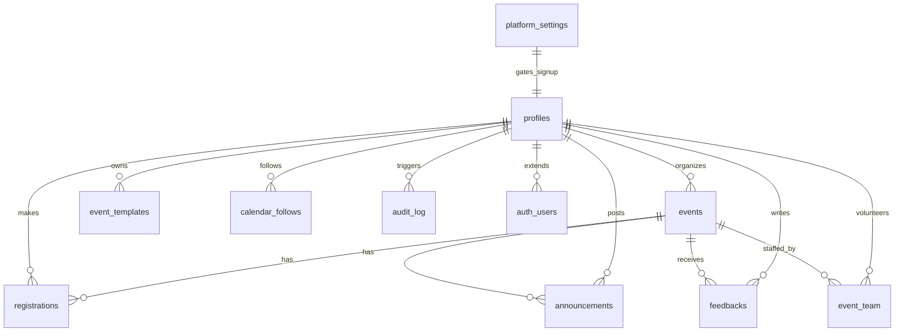

# PROJECT_SUMMARY — Gatherum

> Generated 2026-10-05 by read-only repo analysis. Everything below is based on actual code. `NOT FOUND` / `UNCLEAR` means it was not in the repo. Secrets are masked as `****`.

---

## 1. Project Overview

- **Name:** Gatherum (package.json `name` is still generic `react-example` — see §9)
- **Purpose:** College campus event management + ticketing platform for Poornima (`@poornima.org` email domain enforced in DB trigger + frontend).
- **Main features (implemented in code):**
  - Public event browsing (`EventsPage`), event detail + register/waitlist/cancel (`EventDetailPage`), archives (`ArchivesPage.tsx` exists but route is dead — see §9).
  - Email+password auth + Google OAuth via Supabase Auth (`AuthPage.tsx`), profile completion gate (`ProfilePage.tsx`, `AuthContext.tsx`, `RequireAuth` in `App.tsx`).
  - Student dashboard: my registrations, waitlist, QR-code tickets (`StudentDashboard.tsx`, `react-qr-code`).
  - Organizer dashboard: create/edit/delete/publish/unpublish events, poster upload to Supabase Storage, participant Excel export, QR check-in page (`OrganizerDashboard.tsx`, `OrganizerEventWizard.tsx`, `CheckInPage.tsx`, `exportExcel.ts`, `@yudiel/react-qr-scanner`).
  - Admin dashboard: overview stats, user list + role change + ban/unban, event delete, platform settings, audit log viewer, magic-link reset via Express API (`AdminDashboard.tsx`, `api/index.ts`).
  - Marketing landing page with animated hero, stats, featured events (`HomePage.tsx`, `motion`, `@react-three/fiber`).
- **Target users (inferred):** Students (register/attend), Organizers (create/check-in/export), Admins (moderate/users/settings). Banned-user gate in `App.tsx:36-44`.

---

## 2. Tech Stack

| Layer | Tech | Version (from `package.json`) |
|---|---|---|
| Language | TypeScript | `~5.8.2` |
| Frontend framework | React + React DOM | `^19.0.1` |
| Build / dev | Vite + `@vitejs/plugin-react` | `^6.2.3` / `^5.0.4` |
| Routing | `react-router-dom` | `^7.18.2` |
| Styling | Tailwind CSS via `@tailwindcss/vite`, custom `src/index.css` design system + `src/animations.css` | `^4.1.14` |
| Backend-as-a-Service | Supabase (`@supabase/supabase-js`) — Postgres + Auth + Storage + Realtime | `^2.112.2` |
| Custom backend | Express (serverless via Vercel, `api/index.ts`) + `express-rate-limit` | `^4.21.2` / `^8.6.2` |
| DB driver (scripts/tests) | `pg` | `^8.23.0` |
| QR | `react-qr-code`, `@yudiel/react-qr-scanner`, `qrcode.react` | `^2.2.0` / `^2.6.0` / `^4.2.0` |
| Excel export | `xlsx` | `^0.18.5` |
| Dates | `date-fns`, `react-datepicker` | `^4.4.0` / `^9.1.0` |
| UI/motion | `motion` (motion/react), `lucide-react`, `react-hot-toast`, `react-error-boundary`, `canvas-confetti`, `react-countup`, `recharts`, `@hello-pangea/dnd`, `@react-three/fiber` + `@react-three/drei` + `three` | see `package.json:12-47` |
| Env | `dotenv` | `^17.2.3` |
| Lint/typecheck | `typescript-eslint`, `eslint`, `eslint-plugin-react-hooks/refresh`, `@types/*` | see `package.json:48-62` |
| Database | Postgres 17 (per `supabase/config.toml:42`), Supabase hosted (URL in `.env`) + local Supabase CLI config | — |
| Hosting | Vercel (`vercel.json` rewrites `/api/*` → `/api/index`, SPA fallback to `/index.html`) | — |
| CI | GitHub Actions `.github/workflows/lint.yml` (tsc + eslint) | — |

No `requirements.txt` / `pom.xml`. No axios — all backend calls go through `supabase-js`. No raw `fetch()` to backend in `src` (only `fetch` is NOT FOUND in src; backend Express API is called by — UNCLEAR — no frontend call to `/api/admin/reset-user-access` was found in `src`).

---

## 3. Directory Structure

Depth ≤3 (ignored: `node_modules`, `.git`, `dist`, `supabase/.temp`, `__pycache__` — none of the latter):

```
gatherum/
  api/index.ts              — Express serverless function, sole custom API (admin magic-link reset)
  src/
    main.tsx                — React entry, mounts <App/> + CSS
    App.tsx                 — Router + RequireAuth guards (has dead duplicate routers, see §9)
    index.css               — Full design-system tokens/styles (~brutalist red/yellow theme)
    animations.css          — Keyframe/animation helpers
    components/
      EventCard.tsx         — Event tile (poster, badges, tilt-on-hover, seat count)
      Navbar.tsx            — Role-aware nav (Events/Dashboard/Admin/Profile/Sign In/Out)
      SafeImage.tsx         —  with emoji fallback on error/missing src
    contexts/
      AuthContext.tsx       — Session+profile provider (getSession, onAuthStateChange, fetchProfile)
    lib/
      supabase.ts           — supabase-js client from VITE_ env vars
      utils.ts              — isEventAutoArchived() client-side archival check
      exportExcel.ts        — Organizer participant Excel export via xlsx
    pages/                  — 11 pages (see §5)
    types/index.ts          — Profile/Event/Registration/Announcement/Feedback/PlatformSettings types
  supabase/
    config.toml             — Local Supabase stack config (ports, auth, storage, realtime)
    migrations/0001-0011   — Full schema + RLS + RPCs + storage + archival (see §6)
  public/favicon.svg        — Favicon only
  scripts/concurrency-test.ts — Stub/simulated test (does nothing real)
  .github/workflows/lint.yml — CI: npm ci + npm run lint (tsc) + npx eslint .
  vercel.json               — API + SPA rewrites
  vite.config.ts            — react + tailwind + @ → ./src alias
  tsconfig.json             — ES2022/bundler, @/* → ./* (mismatched, see §9)
  index.html                — Root HTML, mounts /src/main.tsx
  package.json / package-lock.json / bun.lock
  .env / .env.example       — Env vars (names only in §4; values masked)
  .gitignore                — Ignores node_modules, dist, .env*, logs, dev artifacts
  README.md                 — AI-Studio boilerplate (stale, see §10)
  SECURITY.md               — Threat model + verification checklist (accurate for 0001-era schema)
  metadata.json             — {name, description} stub
  openapi.json              — NOT a spec; contains {"message":"Invalid API key"...} error dump
  test_rls.mjs              — Manual RLS test harness (creates users/events via service_role)
  test_registration.js      — Manual registration upsert/cancel script (bypasses RPC)
  test_cancel.sql           — Calls cancel_registration() with hardcoded UUIDs
  fix_test.cjs / dump.cjs / download_stitch.cjs — Dev/test artifacts (gitignored but present)
  full_code.md / code_dump.md — Large code dumps (gitignored but present)
  stitch_screens/           — NOT INSPECTED in detail (design mock folder)
  gatherum-vite.*.log       — Dev server logs
```

Important files one-liners: `api/index.ts` (only Express route), `src/lib/supabase.ts` (single client), `src/types/index.ts` (canonical TS shapes), `supabase/migrations/0001_*` (canonical DB truth), `src/App.tsx` (all routes/guards).

---

## 4. Backend

### 4.1 Entry point / start

- `api/index.ts:56-190` creates `express()` app, `app.set("trust proxy",1)`, `express.json()`, two rate limiters, global `authMiddleware`, one route, `export default app`.
- **No `app.listen()`** by design — Vercel Node builder wraps the default export as a serverless function (`api/index.ts:51-54`). `vercel.json:2-11` rewrites `/api/(.*)` → `/api/index`.
- Startup fail-fast: throws if `SUPABASE_SERVICE_ROLE_KEY` missing (`api/index.ts:16-25`). Warns (does not throw) if URL/anon key missing (`api/index.ts:35-42`).
- Two Supabase clients: `supabase` (anon, only to verify JWTs via `auth.getUser(token)`) and `adminSupabase` (service_role, bypasses RLS).

### 4.2 Complete API endpoint list

**A. Custom Express API (only one):**

| Method | Path | Purpose | Auth | Request body | Response |
|---|---|---|---|---|---|
| POST | `/api/admin/reset-user-access` (`api/index.ts:124`) | Admin sends magic-link to target user (`signInWithOtp shouldCreateUser:false`) + audit log | `Authorization: Bearer <supabase JWT>` required (global middleware `api/index.ts:114-116`); then server-side `profiles.role=='admin'` check via service_role (`api/index.ts:139-148`) | JSON `{ "targetEmail": string }` — 400 if missing | `200 {success:true,message}` / `401 Unauthorized` / `403 Forbidden: Admin access required` / `500 Failed to send access link` / `500 Internal Server Error` |

Rate limiting (per-instance, no shared store — noted in code `api/index.ts:62-64`): `ipLimiter` 100 req/15min/IP on `/api/`, `userLimiter` 50 req/15min/user-or-IP.

**B. Supabase PostgREST (direct table access, RLS-enforced) + RPCs — these are the real "backend":**

Frontend calls these via `supabase-js` (no custom REST wrapper). RLS policies in `0001` (+helpers) decide allow/deny:

| Call | Purpose | Where used |
|---|---|---|
| `auth.signUp({email,password})` | Create user (trigger `handle_new_user` enforces domain + creates `profiles` row) | `AuthPage.tsx:30` |
| `auth.signInWithPassword({email,password})` | Login | `AuthPage.tsx:34` |
| `auth.signInWithOAuth({provider:'google'})` | Google SSO (same DB trigger applies) | `AuthPage.tsx:166` |
| `auth.getSession() / onAuthStateChange / signOut` | Session lifecycle | `AuthContext.tsx:43,49,59` |
| `from('profiles').select/update` | Read own/all profiles (admin), update own profile | `AuthContext:30-35`, `ProfilePage:72`, `AdminDashboard:33`, `HomePage:303-305` |
| `from('events').select/insert/update/delete` | CRUD events (organizer-scoped or admin; public read only `is_unpublished=false`) | `EventsPage:20-27`, `EventDetailPage:33-37`, `OrganizerEventWizard:130,134`, `OrganizerDashboard:24-29,43-46,57`, `AdminDashboard:34,98`, `ArchivesPage:18-24`, `HomePage:294-296`, `CheckInPage:21` |
| `from('registrations').select/update/delete` | Read regs (owner/organizer/team/admin), cancel via UPDATE (BROKEN — no UPDATE policy, see §9), delete by owner/organizer/admin | `EventDetailPage:41-55,78-81`, `StudentDashboard:24-29,55-58`, counts in list pages |
| `from('platform_settings').select` | Read settings (public) | `AdminDashboard:35` |
| `from('audit_log').select` | Admin-only read | `AdminDashboard:36` |
| `storage.from('images').upload/getPublicUrl` | Poster upload `events/<uid>/<file>`, public read | `OrganizerEventWizard:96,102`, policies in `0006` |
| `rpc('register_for_event',{p_event_id}) → 'registered'|'waitlisted'` | Capacity-safe registration (FOR UPDATE lock, deadline/ended checks in `0010`) | `EventDetailPage:65` |
| `rpc('check_in_by_ticket',{p_ticket_id}) → 'success'|'already_checked_in'|'not_found'|'unauthorized'` | QR/manual check-in (organizer/team of that event only) | `CheckInPage:29` |
| `rpc('admin_update_user_role',{p_user_id,p_role})` | Admin role change + audit | `AdminDashboard:67` |
| `rpc('admin_toggle_user_ban',{p_user_id,p_is_banned})` | Ban/unban + audit | `AdminDashboard:76` |
| `rpc('admin_update_settings',{p_allow_global_signups,p_allowed_email_domain,p_maintenance_mode})` | Platform settings + audit | `AdminDashboard:86-90` |
| `rpc('cancel_registration',{p_event_id})` | Correct cancel path (SECURITY DEFINER, `0003`) — **NOT CALLED by frontend** (see §9) | `test_cancel.sql` only |
| `rpc('admin_fetch_users')`, `admin_reconcile_event_counters()`, `invite_volunteer`, `remove_volunteer`, `archive_old_events()` | Exist in DB — **no frontend caller found** (dead/half-implemented) | NOT FOUND in `src` |

`openapi.json` is NOT a spec for the above — it is a Supabase error JSON (`Invalid API key / Only service_role...`).

### 4.3 Authentication / authorization

- Supabase Auth (email+password + Google OAuth). JWT passed as `Bearer` to Express middleware, verified via `supabase.auth.getUser(token)` (`api/index.ts:98-107`).
- DB authorization = RLS + SECURITY DEFINER RPCs that re-check `auth.uid()` / role server-side. `prevent_restricted_profile_updates` trigger blocks client role/ban escalation. `handle_new_user` trigger enforces `allowed_email_domain` + `signups_enabled` at `auth.users` INSERT (cannot be bypassed via raw Auth API).
- Frontend route guards: `RequireAuth` (`App.tsx:22-59`) — requires `user`, blocks `is_banned`, forces `profile_completed` → `/profile` (unless `allowIncomplete`), enforces `role` allowlist else `→ /`.

### 4.4 Middleware / validation / error handling

- Express: `trust proxy`, `express.json()`, IP + user rate limiters, auth middleware (401/500). Per-route try/catch → 400/403/500 JSON. No CORS, helmet, request-id, or validation library (manual `if (!targetEmail)` only).
- Supabase: CHECK constraints (`capacity>0`, `rating 1-5`, `char_length` caps, `end_time>start_time`), enums, UNIQUEs (`(event_id,user_id)` ×2 tables + `ticket_id`), FK cascades, `FOR UPDATE` locks in `register_for_event`, `protect_event_counters` trigger.
- Frontend: per-form manual checks + `toast.error/success`; no schema library (zod/yup NOT FOUND).

### 4.5 Business logic per module

- Registration: `register_for_event` (capacity + waitlist + re-register via UPSERT + audit; `0010` adds ended/deadline + counts `attended` as occupied). Cancel should be `cancel_registration` RPC; waitlist auto-promotion via `promote_from_waitlist` trigger (UPDATE or DELETE path). Counters `registered_count/waitlist_count` maintained by `maintain_event_counters` (`0002`/`0005`).
- Check-in: `check_in_by_ticket` sets `attended=true,status='attended'` idempotently.
- Roles/bans/settings: admin RPCs + `audit_log` inserts. First admin is manual SQL (`README.md:26-28`, `SECURITY.md:152-157`).
- Archival: `is_archived` flag (`0009`) + hourly `pg_cron` `archive_old_events()` (threshold changed 24h → 1h in `0011`); client also hides via `isEventAutoArchived()` (`utils.ts`).
- Export: `exportExcel.ts` verifies organizer client-side then pulls `registrations+profiles` and writes 2-sheet xlsx.

### 4.6 Config / env var names (values masked as ****)

From `.env.example` + `.env` + `api/index.ts` + `src/lib/supabase.ts`:

- Client (Vite, public): `VITE_SUPABASE_URL` (****), `VITE_SUPABASE_ANON_KEY` (****), `VITE_ALLOWED_EMAIL_DOMAIN` (****), `VITE_GOOGLE_CLIENT_ID` (**** — currently placeholder in `.env`).
- Server-only: `SUPABASE_SERVICE_ROLE_KEY` (****), `APP_URL` (****), `PORT` (****). `api/index.ts` also accepts `SUPABASE_URL` / `SUPABASE_ANON_KEY` (non-VITE) with VITE_ fallback for local dev.
- `supabase/config.toml` references `env(OPENAI_API_KEY)`, `env(S3_*)`, `env(SUPABASE_AUTH_*)` — NOT FOUND in `.env` (local-only/optional).

---

## 5. Frontend

- **Framework:** React 19 + Vite 6 + `react-router-dom` v7 (`BrowserRouter`, `Routes/Route/Navigate`, `useLocation/useNavigate/useParams`). Entry `src/main.tsx:7-11` → `src/App.tsx` default export. Styling: Tailwind v4 plugin + hand-rolled CSS variables/brutalist theme in `index.css`; motion page transitions (`AnimatePresence mode="wait"`, `PageWrapper` in `App.tsx:146-157`).
- **Routing (live = `RootRoutes`, `App.tsx:159-197`):**

| Path | Page | Guard |
|---|---|---|
| `/` | `HomePage` | public |
| `/events` | `EventsPage` | public |
| `/events/:id` | `EventDetailPage` | public (register CTA requires login) |
| `/auth` | `AuthPage` | public; redirects `→ /` if session |
| `/student`, `/student/tickets` | `StudentDashboard` (same component, tab state — URL does not switch tabs) | student/organizer/admin + profile-complete |
| `/organizer` | `OrganizerDashboard` | organizer/admin |
| `/organizer/events/new`, `/organizer/events/:id` | `OrganizerEventWizard` (new vs edit by param) | organizer/admin |
| `/organizer/checkin/:eventId` | `CheckInPage` | organizer/admin |
| `/admin` | `AdminDashboard` | admin only |
| `/profile` | `ProfilePage` | any auth, `allowIncomplete` |
| `*` | `→ /` | — |

Note: `/archives` (`ArchivesPage.tsx`) is wired only in dead `AppRoutes` (`App.tsx:76`) and has a `Link` import unused elsewhere — effectively unreachable in the live router (see §9). `AppRoutes` (`App.tsx:61-128`) + `Layout` (`132-142`) are dead code; only `RootRoutes` renders.

- **Key components:**
  - `Navbar.tsx` — logo → `/`, role links (student→`/student`, organizer→`/organizer`, admin→`/admin`), Profile/Sign Out vs Sign In, mobile dropdown (hamburger hidden on desktop via inline `<style>` media query).
  - `EventCard.tsx` — clickable → `/events/:id`, `SafeImage` poster, category emoji, `Ended/Full/Draft` badges, date/location/seats; 3D tilt on mousemove.
  - `SafeImage.tsx` — emoji placeholder if `!src` or `onError`.
  - Pages: `HomePage` (hero + floating 3D emoji images from GitHub CDN, stats, featured events, how-it-works/testimonials sections); `EventsPage` (search + category filter, `is_unpublished=false,is_archived=false`, start_time ≥ yesterday); `EventDetailPage` (poster, organizer card, description, details grid, capacity bar, register/waitlist/cancel states, deadline/past handling); `StudentDashboard` (stats, registrations list, tickets tab with `react-qr-code` QR = `ticket_id`); `OrganizerDashboard` (published/drafts/archived tabs, publish toggle, delete, export, check-in links); `OrganizerEventWizard` (title/category/capacity/dates/location/poster/draft, `react-datepicker`, Storage upload); `CheckInPage` (camera `Scanner` + manual ticket input, `check_in_by_ticket`); `AdminDashboard` (overview/users/events/settings/audit tabs); `AuthPage` (signin/signup tabs, domain hint, Google button); `ProfilePage` (full_name/roll/branch/year/phone/public_rsvp, must-complete banner + redirect-back); `ArchivesPage` (search + auto-archived filter).
- **State management:** No Redux/Zustand. `AuthContext` (`session/user/profile/loading/signOut/refreshProfile`) + local `useState`/`useEffect` per page. No global store, no realtime subscriptions in `src` (realtime publication exists in DB `0002` but no `channel.subscribe` found).
- **Backend calls:** Exclusively `supabase-js` (`supabase.from/select/insert/update/delete`, `supabase.rpc`, `supabase.auth.*`, `supabase.storage.*`) as listed in §4.2. No `axios`/`fetch` to custom API in `src`. Public Supabase URL + anon key are bundled via `import.meta.env.VITE_*` (`supabase.ts:3-4`).
- **Forms & validation:**
  - Auth: required email+password; signup blocks non-`VITE_ALLOWED_EMAIL_DOMAIN` client-side (`AuthPage:25-29`); signin has no domain check (DB trigger is backstop); no password-strength meter.
  - Profile: required full_name/roll/branch/year (`ProfilePage:44-59`), `year_of_study` `parseInt`, `profile_completed` derived boolean; avatar is generated DiceBear URL, not editable.
  - Event wizard: required title/start_time, `capacity>=1` int (`OrganizerEventWizard:109-112`); poster ≤250KB + jpg/png/webp client-only (`78-89`); dates via DatePicker → ISO; `registration_deadline` optional; no end>start check client-side (DB CHECK covers it).
  - Check-in manual input: non-empty only; camera path trusts `rawValue.trim()`.

---

## 6. Database

- **Type + connection:** Postgres 17 via Supabase. Frontend connects with anon key over PostgREST (`supabase-js`); `api/index.ts` uses anon (verify) + service_role (admin ops); scripts use `pg`/`supabase-js` with service_role. Local dev via Supabase CLI (`config.toml`: API 54321, DB 54322, Studio 54323). Remote project URL is in `.env` (masked).
- **Tables/collections (canonical: `0001` + deltas):**

| Table | Fields (type) | PK / FK / UNIQUE |
|---|---|---|
| `profiles` | `id uuid PK→auth.users(id) CASCADE`, `role role_enum DEFAULT 'student'`, `email text`, `full_name text`, `roll_number text`, `branch text`, `year_of_study int`, `phone_number text`, `avatar_url text`, `public_rsvp bool DEFAULT true`, `profile_completed bool DEFAULT false`, `is_banned bool DEFAULT false`, `must_change_password bool DEFAULT false`, `created_at timestamptz`, `updated_at timestamptz` (trigger) | PK `id`; FK to auth.users |
| `events` | `id uuid PK DEFAULT gen_random_uuid()`, `organizer_id uuid→profiles(id) CASCADE`, `title text`, `description text`, `category text`, `start_time timestamptz NOT NULL`, `end_time timestamptz CHECK end>start`, `location text`, `capacity int NOT NULL CHECK>0`, `poster_url text`, `is_unpublished bool DEFAULT true`, `is_archived bool DEFAULT false` (`0009`), `registration_deadline timestamptz` (`0008`), `registered_count int DEFAULT 0 CHECK>=0` (`0002`), `waitlist_count int DEFAULT 0 CHECK>=0` (`0002`), `created_at/updated_at timestamptz` | PK `id` |
| `registrations` | `id uuid PK`, `event_id uuid→events(id) CASCADE`, `user_id uuid→profiles(id) CASCADE`, `status registration_status_enum DEFAULT 'registered'`, `ticket_id text UNIQUE DEFAULT gen_random_uuid()::text`, `attended bool DEFAULT false`, `created_at timestamptz` | PK `id`; UNIQUE `(event_id,user_id)`, UNIQUE `ticket_id` |
| `event_templates` | `id uuid PK`, `organizer_id uuid→profiles CASCADE`, `title/description/category text`, `capacity int`, `poster_url text`, `created_at` | PK `id` |
| `announcements` | `id uuid PK`, `event_id uuid→events CASCADE`, `organizer_id uuid→profiles CASCADE`, `message text NOT NULL CHECK len≤1000`, `created_at` | PK `id` |
| `feedbacks` | `id uuid PK`, `event_id uuid→events CASCADE`, `user_id uuid→profiles CASCADE`, `rating int CHECK 1-5`, `comment text CHECK len≤500`, `created_at` | PK `id`; UNIQUE `(event_id,user_id)` |
| `event_team` | `id uuid PK`, `event_id uuid→events CASCADE`, `user_id uuid→profiles CASCADE`, `role event_team_role DEFAULT 'volunteer'`, `invited_by uuid→profiles SET NULL`, `created_at` | PK `id`; UNIQUE `(event_id,user_id)` |
| `calendar_follows` | `id uuid PK`, `follower_id uuid→profiles CASCADE`, `followed_organizer_id uuid→profiles CASCADE`, `created_at` | PK `id`; UNIQUE `(follower, followed)` |
| `audit_log` | `id uuid PK`, `actor_id uuid→profiles SET NULL`, `action text NOT NULL`, `target_table text`, `target_id uuid`, `details jsonb`, `created_at` | PK `id` (no UPDATE/DELETE RLS policies) |
| `platform_settings` | `id int PK DEFAULT 1 CHECK id=1`, `signups_enabled bool DEFAULT true`, `allowed_email_domain text DEFAULT '@poornima.org'`, `maintenance_mode bool DEFAULT false` | PK `id`; single row seeded (`0001:20`) |
| `storage.objects` (`images` bucket, `0006`) | Supabase-managed; bucket `images` public | Policies: public SELECT; INSERT scoped to `avatars/<uid>/*` or `events/<uid>/*` with `owner=auth.uid()`; UPDATE/DELETE own only |
| Enums | `role_enum(student,organizer,admin)`, `registration_status_enum(registered,waitlisted,cancelled,attended)`, `event_team_role(volunteer)` | — |

Relationships: `profiles 1—N events` (organizer), `events 1—N registrations/announcements/feedbacks/event_team`, `profiles 1—N registrations/feedbacks/follows`, `profiles N—M events` via `event_team`/`calendar_follows`.

- **Mermaid ER:**



- **Indexes:** No explicit `CREATE INDEX` in any migration (verified by grep). Only implicit B-tree indexes from PKs + UNIQUEs (`registrations(event_id,user_id)`, `ticket_id`, `feedbacks(event_id,user_id)`, `event_team(event_id,user_id)`, `calendar_follows(...)`). Foreign-key columns without dedicated indexes (e.g. `registrations.event_id` alone, `events.organizer_id`) will sequential-scan at scale.
- **Migrations:** `0001_gatherum_schema` (schema+RLS+RPCs) → `0002_realtime_counters` (+counters/triggers/realtime pub) → `0003_fix_cancel_registration` (+`cancel_registration` RPC) → `0004_fix_reregistration` (UPSERT fix) → `0005_fix_maintain_event_counters` (cancelled↔registered deltas + backfill) → `0006_add_storage_buckets` (`images` bucket+policies) → `0007_admin_fetch_users` (unused RPC) → `0008_add_registration_deadline` (1-line ALTER) → `0009_event_archival` (`is_archived`+`archive_old_events`+pg_cron hourly) → `0010_fix_register_for_event` (ended/deadline guards + count attended) → `0011_update_archival_rules` (24h→1h). Note `0011` file contains literal `\$\$` escapes (lines 4,15) — UNCLEAR if it applies cleanly via Supabase CLI; verify before demo.
- **Seeds:** `supabase/config.toml:71` points to `./seed.sql`, but **NOT FOUND** in repo. No seed scripts. `platform_settings` single-row INSERT in `0001` is the only seed.

---

## 7. Mock Data

Schema-exact samples (UUIDs illustrative; `ticket_id` is text UUID in current schema):

```sql
-- profiles (id must match auth.users id)
INSERT INTO profiles (id, role, email, full_name, roll_number, branch, year_of_study, phone_number, public_rsvp, profile_completed) VALUES
('11111111-1111-1111-1111-111111111111','student','aarav@poornima.org','Aarav Sharma','POO2023CS001','CSE',2,'9876500001',true,true),
('22222222-2222-2222-2222-222222222222','student','diya@poornima.org','Diya Patel','POO2024EC012','ECE',1,'9876500002',true,true),
('33333333-3333-3333-3333-333333333333','organizer','techclub@poornima.org','Tech Club Lead','POO2022CS050','CSE',3,'9876500003',true,true),
('44444444-4444-4444-4444-444444444444','admin','admin@poornima.org','Campus Admin',NULL,NULL,NULL,NULL,true,true);

-- platform_settings (already seeded as id=1)
-- events
INSERT INTO events (id, organizer_id, title, description, category, start_time, end_time, location, capacity, is_unpublished, is_archived, registration_deadline) VALUES
('a0000000-0000-0000-0000-000000000001','33333333-3333-3333-3333-333333333333','Annual Tech Fest 2025','Hackathon + talks','Technical','2026-11-10T09:00:00+05:30','2026-11-10T17:00:00+05:30','Main Auditorium',100,false,false,'2026-11-08T23:59:00+05:30'),
('a0000000-0000-0000-0000-000000000002','33333333-3333-3333-3333-333333333333','Cultural Night','Music and dance','Cultural','2026-12-01T18:00:00+05:30','2026-12-01T21:00:00+05:30','Open Air Theatre',200,false,false,NULL),
('a0000000-0000-0000-0000-000000000003','33333333-3333-3333-3333-333333333333','Draft Workshop','Unpublished draft','Workshop','2026-11-20T10:00:00+05:30',NULL,'Lab 4',50,true,false,NULL);

-- registrations
INSERT INTO registrations (event_id, user_id, status, ticket_id, attended) VALUES
('a0000000-0000-0000-0000-000000000001','11111111-1111-1111-1111-111111111111','registered','t-aaa-001',false),
('a0000000-0000-0000-0000-000000000001','22222222-2222-2222-2222-222222222222','waitlisted','t-bbb-002',false),
('a0000000-0000-0000-0000-000000000002','11111111-1111-1111-1111-111111111111','attended','t-aaa-003',true);

-- announcements / feedbacks / event_team / calendar_follows / audit_log
INSERT INTO announcements (event_id, organizer_id, message) VALUES ('a0000000-0000-0000-0000-000000000001','33333333-3333-3333-3333-333333333333','Venue changed to Main Auditorium, gates open 8:30 AM');
INSERT INTO feedbacks (event_id, user_id, rating, comment) VALUES ('a0000000-0000-0000-0000-000000000002','11111111-1111-1111-1111-111111111111',5,'Amazing night!');
INSERT INTO event_team (event_id, user_id, role, invited_by) VALUES ('a0000000-0000-0000-0000-000000000001','22222222-2222-2222-2222-222222222222','volunteer','33333333-3333-3333-3333-333333333333');
INSERT INTO calendar_follows (follower_id, followed_organizer_id) VALUES ('11111111-1111-1111-1111-111111111111','33333333-3333-3333-3333-333333333333');
INSERT INTO audit_log (actor_id, action, target_table, target_id, details) VALUES ('11111111-1111-1111-1111-111111111111','register_for_event','registrations','a0000000-0000-0000-0000-000000000001','{"status":"registered"}');
```

Sample request/response per major endpoint (shapes from code):

```jsonc
// POST /api/admin/reset-user-access  (api/index.ts:124)
// Request:  POST /api/admin/reset-user-access
// Headers:  { "Authorization": "Bearer <admin JWT>", "Content-Type": "application/json" }
// Body:     { "targetEmail": "diya@poornima.org" }
// Success:  200 { "success": true, "message": "Magic link sent successfully" }
// Errors:   401 { "error": "Unauthorized" } | 403 { "error": "Forbidden: Admin access required" }
//           400 { "error": "Target email required" } | 500 { "error": "Failed to send access link" }

// rpc register_for_event  (EventDetailPage.tsx:65)
// Request:  supabase.rpc('register_for_event', { p_event_id: "<event uuid>" })
// Success:  data = "registered" | "waitlisted" (toast: Registered! / Added to waitlist!)
// Error:    { message: "This event has already ended." | "Registration deadline has passed." | "Event not found" | "Not authenticated" }

// rpc check_in_by_ticket  (CheckInPage.tsx:29)
// Request:  supabase.rpc('check_in_by_ticket', { p_ticket_id: "<ticket_id from QR>" })
// Success:  data = "success" | "already_checked_in" | "not_found" | "unauthorized"

// rpc admin_update_user_role (AdminDashboard.tsx:67)
// Request:  supabase.rpc('admin_update_user_role', { p_user_id: "<uuid>", p_role: "organizer" })
// Success:  null (toast Role updated!); Error: { message: "Unauthorized" }

// rpc admin_toggle_user_ban / admin_update_settings — same envelope; settings args:
// { p_allow_global_signups: true, p_allowed_email_domain: "@poornima.org", p_maintenance_mode: false }

// PostgREST examples:
// GET events list: supabase.from('events').select('*, registrations(count)').eq('is_unpublished',false)...
//   → [{ id, title, capacity, registration_count (client-derived), ... }]
// GET my registration: supabase.from('registrations').select('*').eq('event_id',id).eq('user_id',uid).maybeSingle()
//   → { id, event_id, user_id, status, ticket_id, attended, created_at } | null
```

---

## 8. How to Run

```bash
# 1. Install (Node 20 per CI; repo has package-lock + bun.lock)
npm install            # or npm ci (CI uses npm ci)

# 2. Env — copy template and fill real values (NEVER commit .env)
cp .env.example .env
# Required names: VITE_SUPABASE_URL, VITE_SUPABASE_ANON_KEY,
#   VITE_ALLOWED_EMAIL_DOMAIN, VITE_GOOGLE_CLIENT_ID (optional),
#   SUPABASE_SERVICE_ROLE_KEY (server-only), APP_URL, PORT

# 3. Database — apply migrations to linked Supabase project
# (Supabase CLI; no seed.sql exists — 0001 seeds platform_settings only)
supabase link --project-ref <ref>   # then
supabase db push
# First admin (one-time, per README.md:26-28):
#   sign up via app, then in SQL Editor:
#   UPDATE profiles SET role='admin' WHERE id='<your-user-uuid>';

# 4. Run frontend (Vite default http://localhost:5173; APP_URL/PORT vars are for Express only)
npm run dev

# 5. Custom API locally — Vercel dev (rewrites /api/* to api/index.ts), or deploy to Vercel
vercel dev
# Production: set server env vars in Vercel → Project Settings → Environment Variables

# 6. Typecheck / lint
npm run lint        # = tsc --noEmit
npm run find-bugs   # = tsc --noEmit && eslint .
```

**Verification status (this session):**

- ✅ `npx tsc --noEmit` (i.e. `npm run lint`) — **passed, exit 0, no output**.
- ❌ `npx eslint .` — **failed, exit 2**: `ESLint couldn't find an eslint.config.(js|mjs|cjs) file` (ESLint v10 needs flat config; repo has none). So `npm run find-bugs` and CI `lint.yml` step `Run ESLint` always fail.
- ⚠️ `npm run dev` / `vercel dev` / Supabase push — **NOT verified** (would need network + real secrets + writes; task is read-only). `gatherum-vite.out/err.log` exist but were not used as proof.
- ⚠️ `npm run build` — **not run** (would write `dist/`, prohibited by read-only task).

---

## 9. Current Issues Found

**Critical (breaks features / security):**

1. **Cancel-registration is broken by RLS.** `EventDetailPage.tsx:75-89` and `StudentDashboard.tsx:54-64` cancel via `from('registrations').update({status:'cancelled'})`, but `0001` defines **no UPDATE policy** on `registrations` (only SELECT/DELETE, `0001:202-213`). The correct `cancel_registration(p_event_id)` RPC (`0003`) is never called from `src` (only `test_cancel.sql:8`). Real users get a 403 on cancel. Fix: call the RPC.
2. **`.env` with real keys present in working dir.** `.env:9-10,17` contain a live Supabase URL + anon + **service_role** key. `.gitignore` does ignore `.env*`, but the file exists locally and must never be committed/shared/screenshots. Report masks values as ****.
3. **Dead router hides `/archives`.** `App.tsx:61-128` (`AppRoutes` with `/archives`) + `App.tsx:132-142` (`Layout`) are never rendered; live `RootRoutes` (`159-197`) has **no `/archives` route**, so `ArchivesPage.tsx` is unreachable. Also double-`Navbar` logic left in dead code.
4. **CI always red.** `.github/workflows/lint.yml:30-31` runs `npx eslint .` but repo has no `eslint.config.js` (verified failure above). `package.json:10` `find-bugs` also always fails for the same reason.
5. **`openapi.json` is not a spec.** Content is `{"message":"Invalid API key","hint":"Only the service_role..."}` — a pasted Supabase error. Any consumer expecting OpenAPI will break.
6. **`0011_update_archival_rules.sql:4,15` has escaped `\$\$`.** If applied via `supabase db push`, the function body delimiters are literal `\$\$` and the migration fails. Needs `$$`.
7. **Check-in does not bind to URL event.** `CheckInPage.tsx:26-44` scans any `ticketId` via `check_in_by_ticket`, which only checks the ticket's own event ownership (`0001:419-424`), never that it equals `:eventId` from the URL. A QR from event A can be checked in on event B's page by that event's organizer.
8. **Overly broad GRANTs contradict least-privilege.** `0001:498-518` does `GRANT ALL PRIVILEGES ON ALL TABLES/FUNCTIONS/SEQUENCES ... TO anon, authenticated` (+ `supabase_admin`). RLS still applies, but any future table without RLS enabled is instantly world-writable. SECURITY.md §5 claims deny-by-default — only true because RLS is enabled everywhere today.

**High (wrong data / UX / mismatches):**

9. **HomePage profile counts always 0 for non-admins.** `HomePage.tsx:303-306` counts `profiles` by role, but RLS (`0001:596`) allows SELECT only for owner or admin. Students/anon get permission errors/empty counts.
10. **Ghost field `student_email`.** `exportExcel.ts:63,78` reads `r.student_email`, which does not exist in `registrations` schema — always falls back. Should be removed.
11. **No check-in timestamp.** `exportExcel.ts:67` uses `created_at` (registration time) as `Check-in Time` with an honest code comment — misleading export. Needs a `checked_in_at` column or `audit_log` lookup.
12. **Capacity counts inconsistent.** List pages use `.neq('registrations.status','cancelled')` embedded counts (includes `registered+waitlisted+attended`), while `EventDetailPage:41-46` counts only `registered+attended`, and DB `register_for_event` (`0010`) counts `registered+attended`. Waitlisted users inflate seat counts on list pages.
13. **TS type drift.** `types/index.ts:22-42` `Event` lacks `registered_count/waitlist_count: number` (added in `0002`) and callers use ad-hoc `registration_count` instead; `Announcement`/`Feedback`/`PlatformSettings` shapes are unused/incomplete vs DB. `Event.category/title` nullable in TS but treated as required in UI.
14. **Vite/TS alias mismatch.** `vite.config.ts:9` maps `@` → `./src`, but `tsconfig.json:19-23` maps `@/*` → `./*`. Imports via `@/` resolve differently in editor vs build.
15. **Google SSO placeholder.** `.env:12` `VITE_GOOGLE_CLIENT_ID=your-google-client-id` + no `redirectTo` in `signInWithOAuth` (`AuthPage:166`) — Google button errors until configured. Also `VITE_GOOGLE_CLIENT_ID` is never read in `src` (dead var).
16. **README is stale boilerplate.** `README.md:1-30` is AI-Studio template mentioning `GEMINI_API_KEY` (not used anywhere in code) and omits Vercel/API/migrations/check-in/export/first-admin correctly. Not submission-ready.
17. **Stale `package.json:2` name `react-example`.** Shows in tabs/bundles; rename to `gatherum`.
18. **Sign-in has no domain hint.** Signup blocks non-domain client-side (`AuthPage:25`), but signin (`AuthPage:34`) and Google SSO rely solely on the DB trigger — non-domain Google users create a half-user then fail confusingly.

**Medium (design/perf/dead code):**

19. **Unused tables with zero UI:** `announcements`, `feedbacks`, `event_templates`, `event_team` (invite/remove RPCs), `calendar_follows` — schema + RLS exist, no `src` caller (grep: zero hits). Either wire UI or remove from scope statement.
20. **Unused RPC `admin_fetch_users` (`0007`).** `AdminDashboard:33` fetches `profiles.select('*')` directly instead of the RPC built for it.
21. **Stub test files ship as docs:** `scripts/concurrency-test.ts:10-20` only logs `Test complete (simulated verification)`; `test_registration.js:33-43` upserts via service_role bypassing capacity logic it claims to test; `test_rls.mjs` hardcodes passwords/emails and deletes/creates real users.
22. **No pagination.** `AdminDashboard:33-37` loads all profiles/events/audit (limit 50 only on audit), `HomePage` limits 6 but others unbounded — `max_rows=1000` (`config.toml:18`) will clip large colleges.
23. **External image CDN without fallback domain control.** `HomePage:334-347` hotlinks `raw.githubusercontent.com/microsoft/fluentui-emoji`; `EventDetailPage:245`/`ProfilePage:89` use `api.dicebear.com` avatars with `onError→hide` (broken-avatar icon). Offline demo = broken hero.
24. **Duplicate data fetching, no cache.** Every page does its own `select('*, registrations(count)')`; `StudentDashboard` fires two sequential queries; no React Query/SWR.
25. **Missing indexes** (§6) on `registrations.event_id`, `events.organizer_id`, `events.start_time`, `audit_log.created_at` — fine for demo, slow at scale.
26. **Commented/dead artifacts in repo:** `fix_test.cjs`, `dump.cjs`, `download_stitch.cjs`, `code_dump.md` (325KB), `full_code.md` (171KB), `*.log`, `.vercel/`, `stitch_screens/` — gitignored but present; confusing for evaluators.
27. **`tsconfig` has no `strict`/`noUnusedLocals`.** `tsc` passes trivially; real bugs (unused `Layout`, `session` in `AppRoutes:62`) are not flagged. No `eslint.config`, no tests (`*.test.*` NOT FOUND), no `seed.sql` despite `config.toml:71`.

Security notes (no hardcoded secrets in `src` — good): anon key via `VITE_` only (correct); service_role only in `api/` + scripts (correct); no SQL string concat (PostgREST + bound PL/pgSQL); UUID PKs; no CORS middleware in Express (serverless default — verify allowed origins before prod); `confirm()` for deletes (no undo); poster validation client-only.

---

## 10. College-Readiness Gaps

- [ ] **README:** replace AI-Studio boilerplate with setup/architecture/demo-credentials/archival rules/roles. Mention `GEMINI_API_KEY` removal.
- [ ] **Tests:** zero `*.test.*`; only manual `test_*.mjs/js/sql` + stub `concurrency-test.ts`. Add at least Vitest unit tests (`isEventAutoArchived`, validators) + documented manual RLS checklist (`SECURITY.md:193-202`).
- [ ] **Comments/docs:** good SQL comments, sparse TS comments; no API doc (fix/replace `openapi.json` or delete it).
- [ ] **Error handling:** toasts only; no `react-error-boundary` usage found despite dependency; no 404 design beyond event-not-found; no offline handling.
- [ ] **Validation:** no schema lib; phone/year/capacity/deadline edge cases unhandled; poster checks client-only.
- [ ] **Loading/empty states:** present on most pages (spinners + empty cards — good), but `EventDetailPage` silently shows nothing on fetch error (`38`), `CheckInPage` has no event-not-found state.
- [ ] **Responsive:** `hide-on-mobile`, `resp-*` classes + inline media queries exist, but Navbar mobile button uses `display:none` + `<style>` injection (`Navbar:79-93`) — fragile; verify on 360px.
- [ ] **Logging:** `console.error` only in `supabase.ts:7`, `CheckInPage:99`; no structured server logging beyond `console.error` in `api/index.ts`.
- [ ] **`.env.example`:** exists and is good — keep in sync (add `SUPABASE_URL`/`SUPABASE_ANON_KEY` non-VITE note for prod).
- [ ] **`.gitignore`:** exists and covers `.env*`, logs, dumps — good, but `bun.lock` + `openapi.json` + `skills-lock.json` are ignored yet present; decide to keep or delete.
- [ ] **Incomplete features:** announcements, feedback/ratings, volunteer invites, calendar follows, templates, push notifications, `registered_count` display, `admin_fetch_users`, `admin_reconcile_event_counters` — either implement minimally or explicitly mark out-of-scope in README/demo.
- [ ] **Demo hygiene:** remove `code_dump.md`/`full_code.md`/`.log`/`fix_test.cjs` from submission folder or ensure ignored; rename package; fix `0011` escapes; add `eslint.config.js` or remove eslint from CI; add `seed.sql` or remove `seed` path from `config.toml`.

---

## 11. Suggested Fix Plan

**Critical (fix before submission/demo):**

- [ ] Fix cancel: replace direct `update({status:'cancelled'})` in `EventDetailPage.tsx:75-89` + `StudentDashboard.tsx:54-64` with `supabase.rpc('cancel_registration',{p_event_id})`; handle `already-cancelled/active-not-found` errors; re-test as student role.
- [ ] Restore `/archives` route in live `RootRoutes` (`App.tsx`) or delete `ArchivesPage.tsx`; delete dead `AppRoutes` + `Layout` functions.
- [ ] Fix `0011_update_archival_rules.sql` `\$\$` → `$$`; run `supabase db push` on a staging project to prove all 11 migrations apply.
- [ ] Add minimal `eslint.config.js` (or drop eslint step from `lint.yml` + `find-bugs` script) so CI is green; keep `tsc --noEmit` green.
- [ ] Replace `openapi.json` with real spec (or delete file + remove references); never submit an error-dump as a spec.
- [ ] Bind check-in to URL event: pass `p_event_id` alongside `p_ticket_id` (extend RPC) or verify `ticket.event_id === eventId` client-side after fetch before showing success.
- [ ] Rotate any exposed service_role key if `.env` was ever pasted/committed; confirm `.env` is gitignored (`git status --ignored`) and never zip `.env` with submission.

**Important (evaluator will notice):**

- [ ] Rewrite `README.md` (setup, roles, demo accounts, features, architecture diagram, test steps, known limits).
- [ ] Rename `package.json` → `gatherum`; align `tsconfig` `@/*` with `vite.config` (`./src/*`); enable `strict:true`.
- [ ] Fix counts: use one definition (DB `registered_count` or `status IN (registered,attended)` everywhere); remove `.neq('registrations.status','cancelled')` embedded-count hack or prove it filters correctly.
- [ ] Fix `HomePage` stats for non-admins (RPC or public stats view) instead of direct `profiles` counts.
- [ ] Remove `r.student_email` references; add `checked_in_at` column or document `created_at` limitation in export header.
- [ ] Configure Google OAuth (`redirectTo`, authorized redirect in Supabase dashboard) or remove button + `VITE_GOOGLE_CLIENT_ID` until ready.
- [ ] Add indexes: `registrations(event_id)`, `registrations(user_id)`, `events(organizer_id)`, `events(start_time)`, `audit_log(created_at)`.
- [ ] Add `seed.sql` with demo users/events (or remove `sql_paths` from `config.toml`).

**Nice to have (bonus marks):**

- [ ] Wire one neglected table minimally (e.g. announcements on event detail + organizer post box) to show breadth; or explicitly scope them out.
- [ ] Add Vitest + 5-10 unit tests; document manual RLS test run (`test_rls.mjs` cleaned, no hardcoded creds).
- [ ] Paginate admin tables; add `react-error-boundary` fallback; add empty/error state for check-in event load.
- [ ] Self-host hero images or add `loading="lazy"` + offline fallback; replace DiceBear `onError→display:none` with initials avatar.
- [ ] Delete/ignore cleanup: `code_dump.md`, `full_code.md`, `*.log`, `dump.cjs`, `download_stitch.cjs`, `fix_test.cjs`, `.vercel/` from submission.

---

## 12. Key Code Excerpts

**1. `api/index.ts:80-115` — Auth + rate-limit middleware (core backend gate):**
```ts
const authMiddleware = async (req, res, next) => {
  const authHeader = req.headers.authorization;
  if (!authHeader || !authHeader.startsWith("Bearer ")) {
    res.status(401).json({ error: "Unauthorized" }); return;
  }
  const token = authHeader.split(" ")[1];
  if (!supabase) { res.status(500).json({ error: "Server configuration error" }); return; }
  try {
    const { data: { user }, error } = await supabase.auth.getUser(token);
    if (error || !user) { res.status(401).json({ error: "Unauthorized" }); return; }
    (req as any).user = user; next();
  } catch { res.status(401).json({ error: "Unauthorized" }); }
};
app.use("/api/", ipLimiter); app.use("/api/", authMiddleware); app.use("/api/", userLimiter);
```

**2. `api/index.ts:124-148` — Sole custom route (admin magic-link reset):**
```ts
app.post("/api/admin/reset-user-access", async (req, res) => {
  const { targetEmail } = req.body;
  if (!targetEmail) { res.status(400).json({ error: "Target email required" }); return; }
  const { data: profile, error: profileError } = await adminSupabase
    .from("profiles").select("role").eq("id", user.id).single();
  if (profileError || (profile as any)?.role !== "admin") {
    res.status(403).json({ error: "Forbidden: Admin access required" }); return;
  }
  const { error: sendError } = await adminSupabase.auth.signInWithOtp({
    email: targetEmail, options: { shouldCreateUser: false },
  });
  // ... audit_log insert, res.json({ success: true, ... })
});
```

**3. `supabase/migrations/0001_gatherum_schema.sql:352-386` — Registration RPC (capacity lock):**
```sql
CREATE OR REPLACE FUNCTION register_for_event(p_event_id uuid)
RETURNS registration_status_enum AS $$
DECLARE v_capacity int; v_registered_count int; v_status registration_status_enum;
  v_user_id uuid := (select auth.uid());
BEGIN
  SELECT capacity INTO v_capacity FROM events WHERE id = p_event_id FOR UPDATE;
  SELECT count(*) INTO v_registered_count FROM registrations
    WHERE event_id = p_event_id AND status = 'registered';
  IF v_registered_count < v_capacity THEN v_status := 'registered';
  ELSE v_status := 'waitlisted'; END IF;
  INSERT INTO registrations (event_id, user_id, status, created_at, attended)
  VALUES (p_event_id, v_user_id, v_status, now(), false)
  ON CONFLICT (event_id, user_id) DO UPDATE SET status = EXCLUDED.status, ...;
  RETURN v_status;
END; $$ LANGUAGE plpgsql SECURITY DEFINER SET search_path = public;
```
(plus `0010` deadline/ended guards — see §6.)

**4. `src/contexts/AuthContext.tsx:29-56` — Session + profile bootstrap:**
```tsx
async function fetchProfile(userId: string) {
  const { data, error } = await supabase.from('profiles').select('*').eq('id', userId).single();
  if (!error && data) setProfile(data as Profile);
}
useEffect(() => {
  supabase.auth.getSession().then(({ data: { session } }) => {
    setSession(session);
    if (session?.user) fetchProfile(session.user.id).finally(() => setLoading(false));
    else setLoading(false);
  });
  const { data: { subscription } } = supabase.auth.onAuthStateChange((_event, session) => {
    setSession(session);
    if (session?.user) fetchProfile(session.user.id); else setProfile(null);
  });
  return () => subscription.unsubscribe();
}, []);
```

**5. `src/App.tsx:22-59,159-197` — Guards + live router:**
```tsx
function RequireAuth({ children, role, allowIncomplete }) {
  const { user, profile, loading } = useAuth(); const location = useLocation();
  if (loading) return (<div className="page-loader"><div className="spinner" /></div>);
  if (!user) return <Navigate to="/auth" state={{ from: location }} replace />;
  if (profile?.is_banned) return (/* Account Suspended */);
  if (!allowIncomplete && profile && !profile.profile_completed)
    return <Navigate to="/profile" state={{ from: location, mustComplete: true }} replace />;
  if (role && profile && !allowed.includes(profile.role)) return <Navigate to="/" replace />;
  return children;
}
// RootRoutes: /,/events,/events/:id,/auth,/student,/organizer,/organizer/events/new,
//   /organizer/events/:id,/organizer/checkin/:eventId,/admin,/profile (NO /archives — bug §9)
```

**6. `src/pages/EventDetailPage.tsx:62-89` — Register (correct RPC) vs cancel (broken direct update):**
```tsx
const { data, error } = await supabase.rpc('register_for_event', { p_event_id: id });
// ... toast Registered!/waitlist, fetchEvent()
async function handleCancel() {
  const { error } = await supabase.from('registrations').update({ status: 'cancelled' }).eq('id', myReg.id);
  // BUG: no UPDATE RLS policy → 403 for real users; should call cancel_registration RPC
}
```

**7. `src/lib/exportExcel.ts:5-39` — Export auth check + join:**
```ts
const { data: eventData } = await supabase.from('events').select('organizer_id').eq('id', eventId).single();
if (eventData.organizer_id !== currentUserId) throw new Error('You are not authorized...');
const { data: regs } = await supabase.from('registrations').select(`
  *, profile:profiles!inner (full_name, roll_number, branch, email, phone_number)`)
  .eq('event_id', eventId);
// then splits into Present (attended/status) vs Waitlisted sheets via xlsx
```

**8. `src/lib/supabase.ts:1-10` + `src/types/index.ts:4-20` — Client + canonical profile shape:**
```ts
// supabase.ts
import { createClient } from '@supabase/supabase-js';
const supabaseUrl = import.meta.env.VITE_SUPABASE_URL as string;
const supabaseAnonKey = import.meta.env.VITE_SUPABASE_ANON_KEY as string;
export const supabase = createClient(supabaseUrl, supabaseAnonKey);
```
```ts
// types/index.ts
export interface Profile { id: string; role: UserRole; email: string|null; full_name: string|null;
  roll_number: string|null; branch: string|null; year_of_study: number|null; phone_number: string|null;
  avatar_url: string|null; public_rsvp: boolean; profile_completed: boolean; is_banned: boolean;
  must_change_password: boolean; created_at: string; updated_at: string; }
```

---

*End of summary. Next step for another engineer: start with §11 Critical list, then §8 to run locally.*
